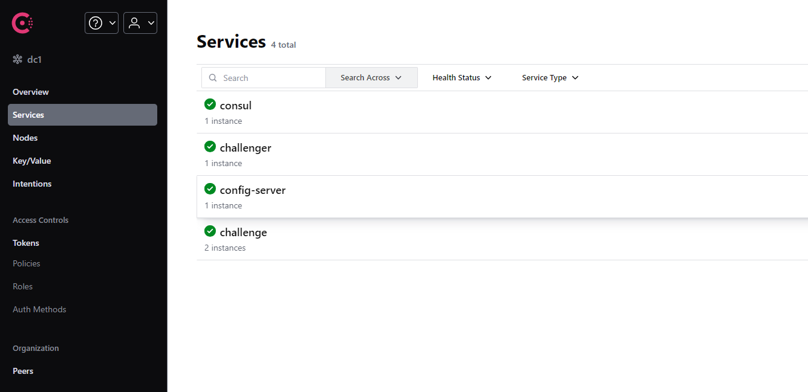
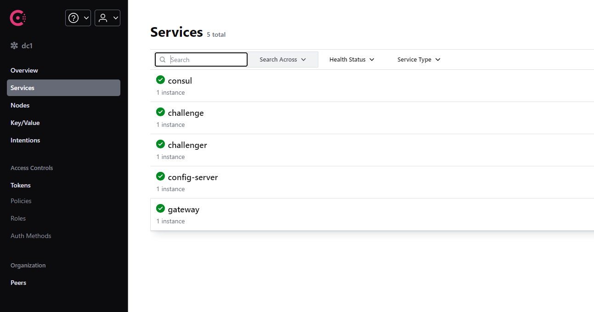
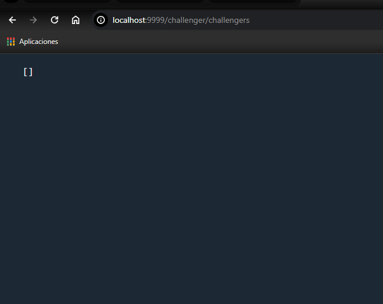

# GATEWAY
## CONFIGURE GATEWAY
- Dynamics Rootes

<pre>
  <code>
@SpringBootApplication
public class GatewayApplication {

	public static void main(String[] args) {
		SpringApplication.run(GatewayApplication.class, args);
	}

	@Bean
	DiscoveryClientRouteDefinitionLocator routes(ReactiveDiscoveryClient discoveryClient, DiscoveryLocatorProperties properties){
		return new DiscoveryClientRouteDefinitionLocator(discoveryClient,properties);
	}

}
  </code>
</pre>

- Configure properties

<pre>
  <code>
server:
  port: 9999
spring:
  application:
    name: gateway
  config:
    import: optional:configserver:http://localhost:8888
management:
  endpoints:
    web:
      exposure:
        include: '*'
  </code>
</pre>

-- add  and start challenger service

-- start gateway service

-- test gateway on challenger service gel All challengers

  
